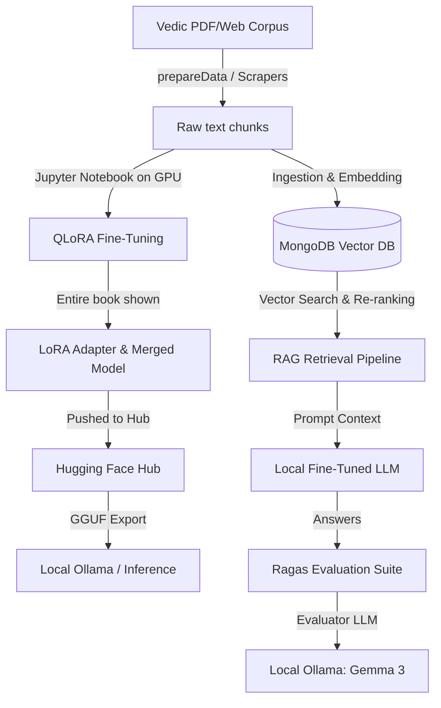

# VedaGPT: Continued Pre-Training, Fine-Tuning & RAG Pipeline 🪶

A premium data curation, model fine-tuning, deployment, and Retrieval-Augmented Generation (RAG) evaluation pipeline for ancient Indian Vedic literature (Sanskrit, Hindi, and English), starting with the four primary Vedas: **Rig Veda**, **Sama Veda**, **Yajur Veda**, and **Atharva Veda**.

---

## 🎯 Architecture & Roadmap
The project contains two distinct architectures designed to run in a sequential workflow:
1. **Continuous Pre-Training & QLoRA Fine-Tuning**: Infusing deep domain-specific Vedic knowledge into the model parameters using high-performance GPU fine-tuning.
2. **Retrieval-Augmented Generation (RAG) & Evaluation**: Supplementing the custom fine-tuned and quantized models with a vector database (MongoDB Atlas) and evaluating the performance using the Ragas framework.



---

## 💻 Tech Stack & Models Used

### 1. Base Model
* **Model**: `unsloth/Llama-3.2-3B-Instruct`
* Loaded in **4-bit quantization** (`nf4` double quantization) via Unsloth during fine-tuning, and via `BitsAndBytesConfig` during local inference for high-speed computation on consumer GPUs.

### 2. Fine-Tuning (GPU-Powered)
* **Pipeline**: Handled entirely inside the Jupyter Notebook `continuousPreTrainStyle/qloraFineTune.ipynb` on a high-performance GPU (Google Colab / Jupyter environment).
* **Training strategy**: Once initial parameters and hyperparameters were stable, the model was shown the **entire book** to ensure thorough semantic comprehension and alignment.
* *Note: The scripts `continuousPreTrainStyle/finetuneContinueousPretrain.py` and `continuousPreTrainStyle/evaluateContinueousPretrain.py` are deprecated and not used.*

### 3. Model Deployment & Quantization
* **Hugging Face Hub Repositories**:
  * **LoRA Adapters**: `shinigamiRaj/Vedas-Llama-3.2-3B-LoRA`
  * **Merged 16-bit Model**: `shinigamiRaj/Vedas-Llama-3.2-3B-Merged`
* **Local Quantization**: 
  * Exported to **GGUF format** using the `q4_k_m` quantization method for efficient, CPU/GPU-split local inference (via Ollama or LM Studio).
  * 4-bit local quantization runs on non-Apple devices via `bitsandbytes`.

### 4. RAG (Retrieval-Augmented Generation)
* **Vector Database**: **MongoDB Atlas Vector Search** (Index name: `vedic_index`).
* **Embedding Model**: `BAAI/bge-base-en-v1.5` (outputs 768-dimensional vectors).
* **Two-Stage Retrieval Pipeline**:
  * **Stage 1 (Vector Search)**: Fast, broad recall using cosine similarity vector search on MongoDB Atlas.
  * **Stage 2 (Cross-Encoder Re-ranking)**: Precise re-scoring of candidate passages using `BAAI/bge-reranker-v2-m3` to yield the top relevant contexts.

### 5. RAG Evaluation (Ragas Framework)
* **Evaluation Toolkit**: **Ragas** (evaluating Context Precision, Context Recall, Faithfulness, and Answer Relevancy).
* **Evaluator LLM**: Local Ollama model **`gemma3:4b-it-qat`** (Quantization-Aware Trained model running locally on Ollama at `http://127.0.0.1:11434`, bypassing OpenAI API costs).

---

## 🛠️ Step-by-Step Execution Guide

To run the pipeline, you must follow this exact order: **1. Continuous Pre-Training Style** followed by **2. RAG Style**.

### Phase 1: Continuous Pre-Training & Inference

1. **Configure Environment Variables**:
   Create a `.env` file in the root directory (and `RAGStyle/.env`) and add your keys:
   ```env
   HF_TOKEN=your_huggingface_write_token
   MONGODB_URI="your_mongodb_connection_string"
   ```

2. **Scrape or Prepare Raw Text**:
   Extract and chunk book pages from PDFs or scrapers:
   ```bash
   python3 continuousPreTrainStyle/prepareContinueousPreTrainData.py
   ```

3. **Run GPU Fine-Tuning**:
   * Open `continuousPreTrainStyle/qloraFineTune.ipynb` in Google Colab or your local GPU environment.
   * Run all cells to mount Google Drive, install Unsloth/Transformers dependencies, chunk the dataset with a 20% sliding overlap, apply the Llama-3 chat template, fine-tune the model on the **entire book**, and push adapters/merged weights to Hugging Face.

4. **Run Local Fine-Tuned Inference**:
   Test the custom fine-tuned model directly on your local machine:
   ```bash
   python3 continuousPreTrainStyle/inference.py
   ```

---

### Phase 2: RAG Ingestion, Retrieval & Evaluation

1. **Ingest and Embed Data**:
   Embed and upload the scriptures to MongoDB Atlas using the upgraded BGE embeddings:
   ```bash
   python3 RAGStyle/ingest_data.py
   ```
   *Make sure you configure your MongoDB Vector Search Index (`vedic_index`) to use `numDimensions: 768`.*

2. **Run Interactive RAG CLI**:
   Ask questions to the fine-tuned model boosted by vector search and Cross-Encoder re-ranking:
   ```bash
   python3 RAGStyle/rag_inference.py
   ```

3. **Start Local Ollama Server**:
   Make sure Ollama is installed and running, then pull the evaluator model:
   ```bash
   ollama pull gemma3:4b-it-qat
   ```

4. **Run RAG Evaluation**:
   Benchmarking the RAG system using Ragas and local Ollama:
   ```bash
   python3 RAGStyle/evaluate_rag.py
   ```
   The results will output to `RAGStyle/eval_results.json` and a human-readable summary will save to `RAGStyle/eval_summary.txt`.

---

## 🐳 Docker Setup
A Dockerfile is provided to quickly build a containerized environment with all system and Python libraries installed.

### 1. Build the Docker Image
```bash
docker build -t vedagpt-pipeline .
```

### 2. Run the Container
You can run any script inside the container by overriding the command. Mount your `.env` file to pass credentials:
```bash
# Run RAG Inference (Default CMD)
docker run -it --env-file .env vedagpt-pipeline

# Run Data Ingestion
docker run -it --env-file .env vedagpt-pipeline python RAGStyle/ingest_data.py

# Run RAG Evaluation (Ensure Ollama is running and accessible from the container)
docker run -it --env-file .env vedagpt-pipeline python RAGStyle/evaluate_rag.py
```

---

## 📂 Project Structure
```text
├── books/                             # PDF source books (Sama Veda, etc.)
├── continuousPreTrainStyle/           # Continued Pre-training files
│   ├── data/                          # Folder for pre-train datasets
│   ├── lora_model/                    # Local LoRA adapter files
│   ├── qloraFineTune.ipynb            # [ACTIVE] GPU Fine-tuning & deployment notebook
│   ├── prepareContinueousPreTrainData.py # PDF overlapping page-chunk extractor
│   ├── inference.py                   # Local fine-tuned model tester
│   ├── finetuneContinueousPretrain.py # [DEPRECATED] Unused local training script
│   └── evaluateContinueousPretrain.py # [DEPRECATED] Unused local evaluation script
├── RAGStyle/                          # RAG and Evaluation files
│   ├── .env                           # RAG environment secrets
│   ├── ingest_data.py                 # MongoDB vector search ingestor
│   ├── rag_inference.py               # Interactive RAG search & chat script
│   └── evaluate_rag.py                # Ragas evaluation runner (via Ollama)
├── Dockerfile                         # Container setup for libraries installation
├── requirements.txt                   # Master Python library dependency list
├── .env                               # Root environment secrets
└── README.md                          # Main project documentation
```
