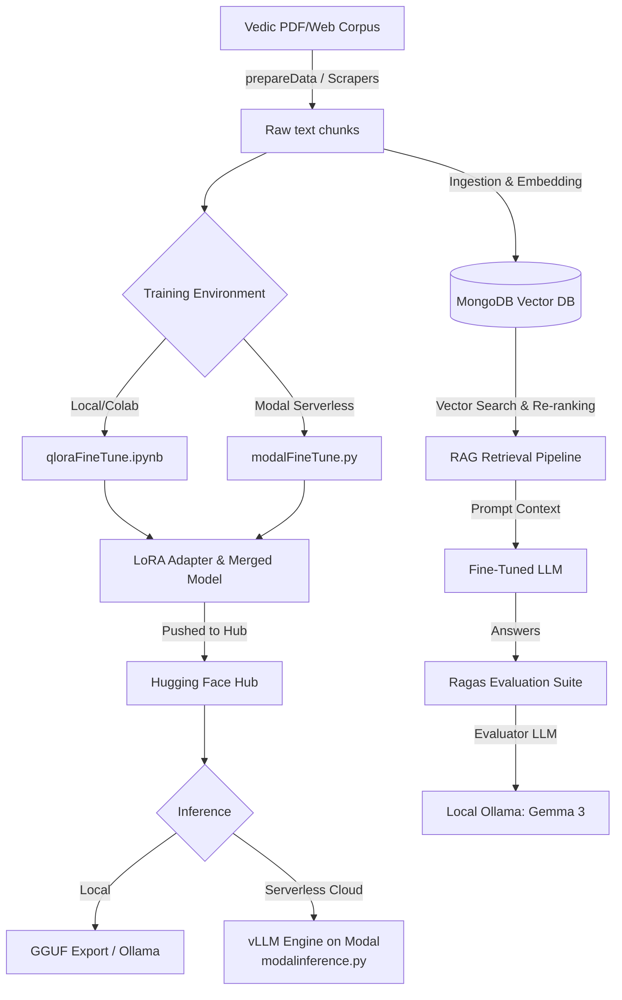

# VedaGPT: Continued Pre-Training, Fine-Tuning & RAG Pipeline 🪶

A premium data curation, model fine-tuning, deployment, and Retrieval-Augmented Generation (RAG) evaluation pipeline for ancient Indian Vedic literature (Sanskrit, Hindi, and English), starting with the four primary Vedas: **Rig Veda**, **Sama Veda**, **Yajur Veda**, and **Atharva Veda**, as well as Ayurvedic texts like **Charaka Samhita** and **Sushruta Samhita**.

---

## 🎯 Architecture & Roadmap
The project contains distinct architectures designed to run in a sequential workflow, supporting both local/Colab-based and Modal serverless environments:
1. **Continuous Pre-Training & QLoRA Fine-Tuning**: Infusing deep domain-specific Vedic knowledge into the model parameters using high-performance GPU fine-tuning (Unsloth on Colab or Modal Serverless).
2. **Serverless Inference (vLLM)**: Blazing fast inference hosted on Modal using the vLLM engine.
3. **Retrieval-Augmented Generation (RAG) & Evaluation**: Supplementing the custom fine-tuned and quantized models with a vector database (MongoDB Atlas) and evaluating the performance using the Ragas framework.



---

## 💻 Tech Stack & Models Used

### 1. Base Models
* **Serverless Pipeline Model**: `Qwen/Qwen2.5-14B-Instruct` (High-capability model deployed on Modal).
* **Local Pipeline Model**: `unsloth/Llama-3.2-3B-Instruct`
* Loaded in **4-bit quantization** (`nf4` double quantization) via Unsloth during fine-tuning.

### 2. Fine-Tuning (GPU-Powered)
We support two primary fine-tuning tracks:
* **Modal Serverless Fine-Tuning**: Handled via `continuousPreTrainStyle/modalFineTune.py`. Automatically provisions cloud GPUs, attaches persistent volumes for checkpointing, trains using Unsloth, merges the model, and pushes directly to Hugging Face.
* **Jupyter/Colab Fine-Tuning**: Handled via `continuousPreTrainStyle/qloraFineTune.ipynb`.
* *Note: The scripts `continuousPreTrainStyle/finetuneContinueousPretrain.py` and `continuousPreTrainStyle/evaluateContinueousPretrain.py` are deprecated.*

### 3. Model Deployment & Inference
* **Hugging Face Hub Repositories**:
  * **Merged 16-bit Qwen Model**: `shinigamiRaj/IndicVedas`
  * **Llama LoRA Adapters**: `shinigamiRaj/Vedas-Llama-3.2-3B-LoRA`
* **Modal vLLM Inference**: 
  * Blazing fast cloud inference using the **vLLM** engine running on Modal via `continuousPreTrainStyle/modalinference.py`. Includes continuous batching, PagedAttention, and an interactive CLI.
* **Local Quantization**: 
  * Exported to **GGUF format** for efficient, CPU/GPU-split local inference (via Ollama or LM Studio).

### 4. RAG (Retrieval-Augmented Generation)
* **Vector Database**: **MongoDB Atlas Vector Search** (Index name: `vedic_index`).
* **Embedding Model**: `BAAI/bge-base-en-v1.5` (outputs 768-dimensional vectors).
* **Two-Stage Retrieval Pipeline**:
  * **Stage 1 (Vector Search)**: Fast, broad recall using cosine similarity vector search on MongoDB Atlas.
  * **Stage 2 (Cross-Encoder Re-ranking)**: Precise re-scoring of candidate passages using `BAAI/bge-reranker-v2-m3` to yield the top relevant contexts.

### 5. RAG Evaluation (Ragas Framework)
* **Evaluation Toolkit**: **Ragas** (evaluating Context Precision, Context Recall, Faithfulness, and Answer Relevancy).
* **Evaluator LLM**: Local Ollama model **`gemma3:4b-it-qat`** (Quantization-Aware Trained model running locally on Ollama at `http://127.0.0.1:11434`).

---

## 🛠️ Step-by-Step Execution Guide

### Phase 1: Data Preparation
1. **Configure Environment Variables**:
   Ensure you have configured your environment keys in the root `.env` (and `RAGStyle/.env`):
   ```env
   HF_TOKEN=your_huggingface_write_token
   MONGODB_URI="your_mongodb_connection_string"
   MODAL_TOKEN_ID=your_modal_token_id       # If using Modal
   MODAL_TOKEN_SECRET=your_modal_token_secret # If using Modal
   ```

2. **Scrape Web Sources & Extract PDFs**:
   ```bash
   python3 continuousPreTrainStyle/scrape_rig_veda.py
   python3 continuousPreTrainStyle/prepareContinueousPreTrainData.py
   python3 continuousPreTrainStyle/splitContinueousPretrainData.py
   ```

### Phase 2: Fine-Tuning & Inference (Choose Your Style)

#### Option A: Modal Serverless Cloud (New ✨)
1. **Deploy Fine-Tuning Job**:
   This spins up an L40S GPU on Modal, runs Unsloth fine-tuning, merges the LoRA adapters, and pushes to Hugging Face.
   ```bash
   modal run continuousPreTrainStyle/modalFineTune.py
   ```
2. **Run vLLM Interactive Inference**:
   Deploy the fine-tuned model to a fast vLLM engine hosted on Modal with a clean, interactive CLI:
   ```bash
   # Run the interactive chat CLI (use -q to avoid progress bar interference)
   modal run -q continuousPreTrainStyle/modalinference.py
   
   # Or run the built-in test suite
   modal run continuousPreTrainStyle/modalinference.py --test
   ```

#### Option B: Local / Google Colab (Classic)
1. **Run GPU Fine-Tuning**: Open `continuousPreTrainStyle/qloraFineTune.ipynb` in Colab, mount Google Drive, and run the Unsloth training loop.
2. **Run Local Inference**: Test the local adapters via `python3 continuousPreTrainStyle/inference.py`.
3. **Evaluate**: Compare models using `python3 evaluate_all_models.py`.

---

### Phase 3: RAG Ingestion, Retrieval & Evaluation

1. **Set Up MongoDB Atlas Manually**:
   * Create a database named `vedic_rag`, collection `scriptures`, and a Vector Search index named `vedic_index` (768 dimensions, cosine similarity).

2. **Ingest and Embed Data**:
   ```bash
   python3 RAGStyle/ingest_data.py
   ```

3. **Run Interactive RAG CLI**:
   ```bash
   python3 RAGStyle/rag_inference.py
   ```

4. **Run RAG Evaluation (Ragas)**:
   ```bash
   ollama pull gemma3:4b-it-qat
   python3 RAGStyle/evaluate_rag.py
   ```

---

## 📂 Project Structure
```text
├── books/                             # PDF source books (Sama Veda, etc.)
├── continuousPreTrainStyle/           # Continued Pre-training files
│   ├── data/                          # Folder for pre-train datasets
│   ├── modalFineTune.py               # [ACTIVE] Modal Serverless Unsloth training script
│   ├── modalinference.py              # [ACTIVE] Modal Serverless vLLM inference CLI
│   ├── qloraFineTune.ipynb            # [ACTIVE] Colab/Jupyter Fine-tuning notebook
│   ├── prepareContinueousPreTrainData.py # PDF overlapping page-chunk extractor
│   ├── inference.py                   # Local fine-tuned model tester
│   ├── finetuneContinueousPretrain.py # [DEPRECATED] Unused local training script
│   └── evaluateContinueousPretrain.py # [DEPRECATED] Unused local evaluation script
├── RAGStyle/                          # RAG and Evaluation files
│   ├── .env                           # RAG environment secrets
│   ├── ingest_data.py                 # MongoDB vector search ingestor
│   ├── rag_inference.py               # Interactive RAG search & chat script
│   └── evaluate_rag.py                # Ragas evaluation runner (via Ollama)
├── Dockerfile                         # Container setup for libraries installation
├── requirements.txt                   # Master Python library dependency list
├── .env                               # Root environment secrets
└── README.md                          # Main project documentation
```
